# Job Portal
<li>Before starting don't forget installing requirements: pip install -r requirements.txt
<li>To run this code in local host use write this code in command prompt or git bash (or any similar): python manage.py runserver
<b><li>Homepage:
  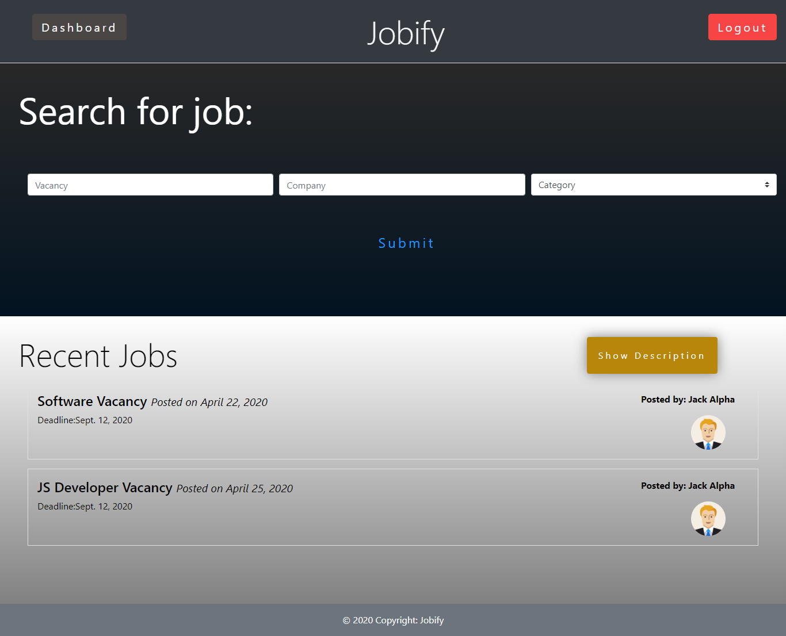</img>
<li>Signup Page:
  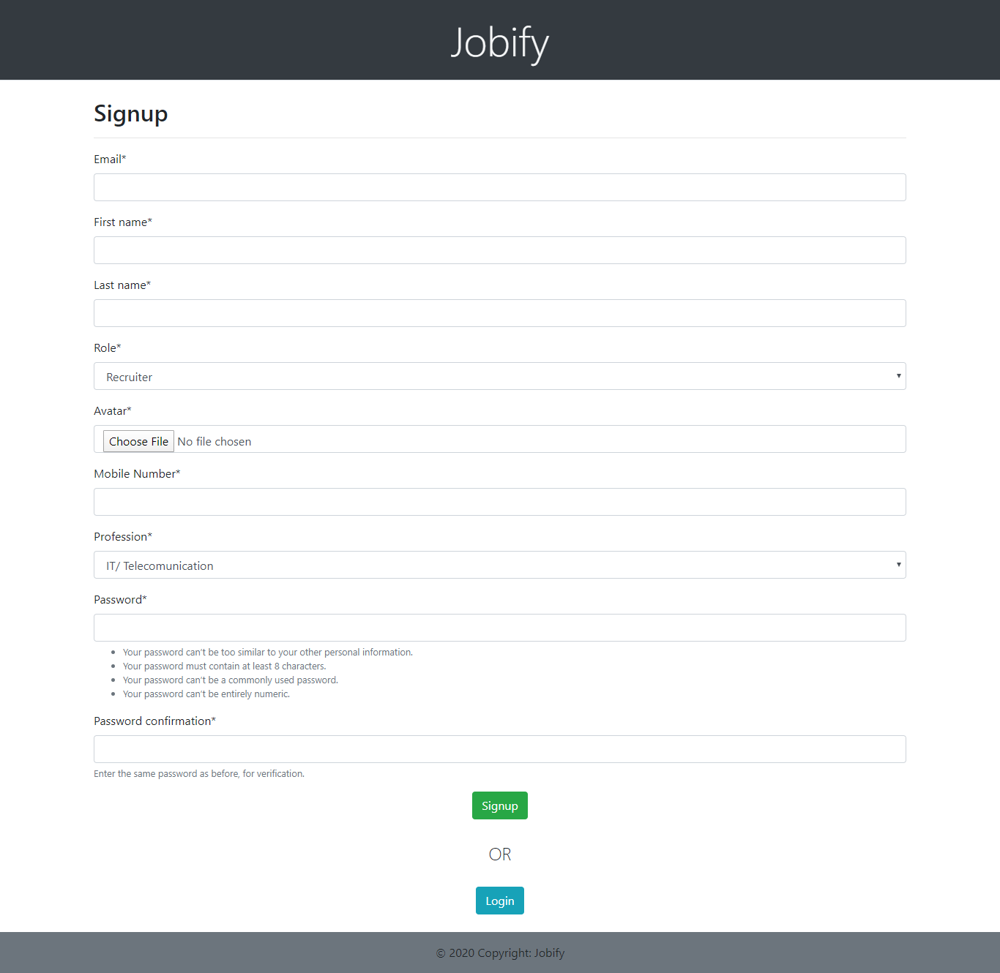</img>
<li>Login Page:
  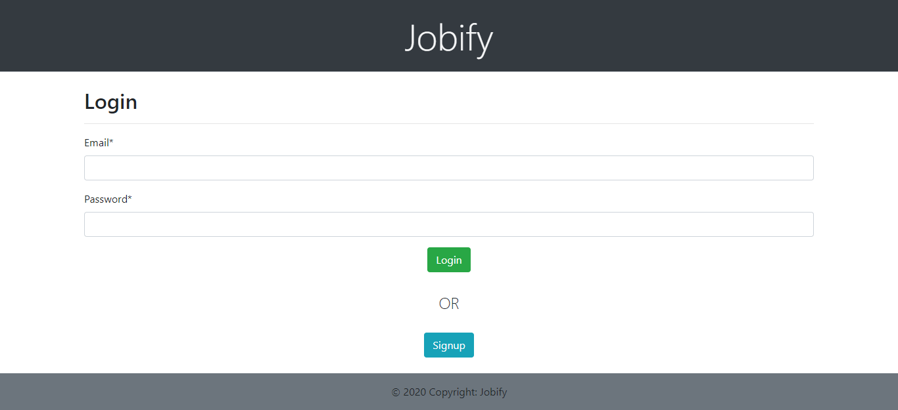</img>
<li>JobSeekers Dashboard:
  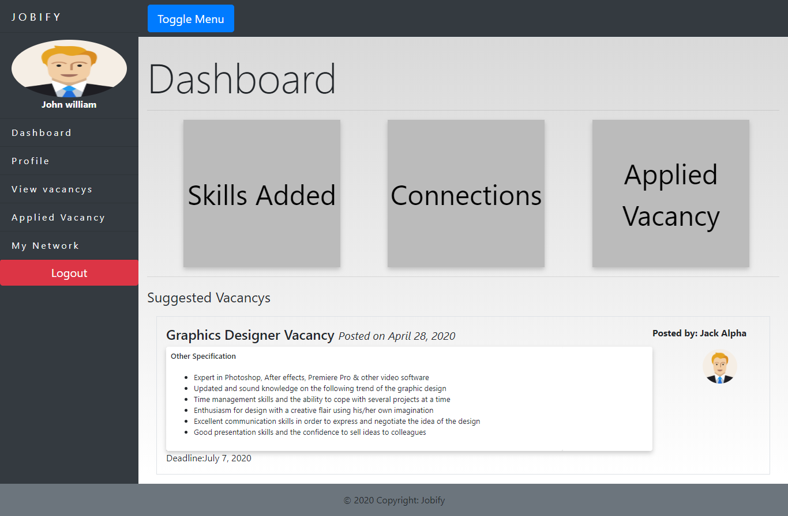</img>
<li>Recruiter Dashboard:
  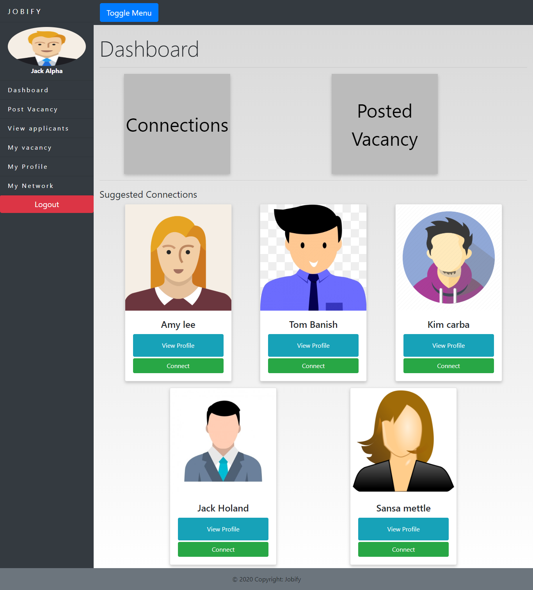</img>
<li>Post Vacancy:
  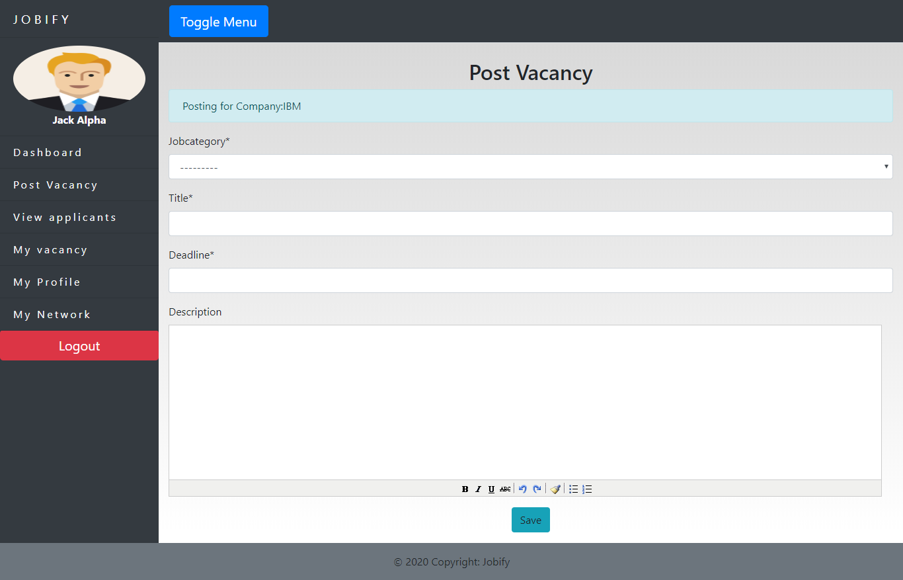</img>
<li>View Vacancy:
  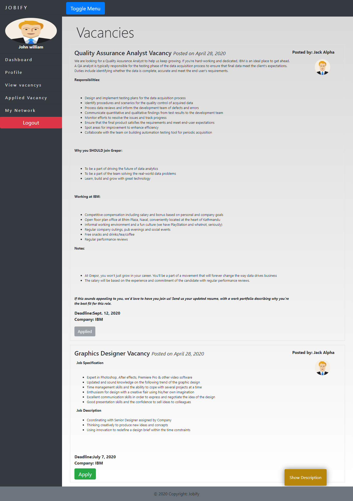</img>
<li>Applied Vacancy:
  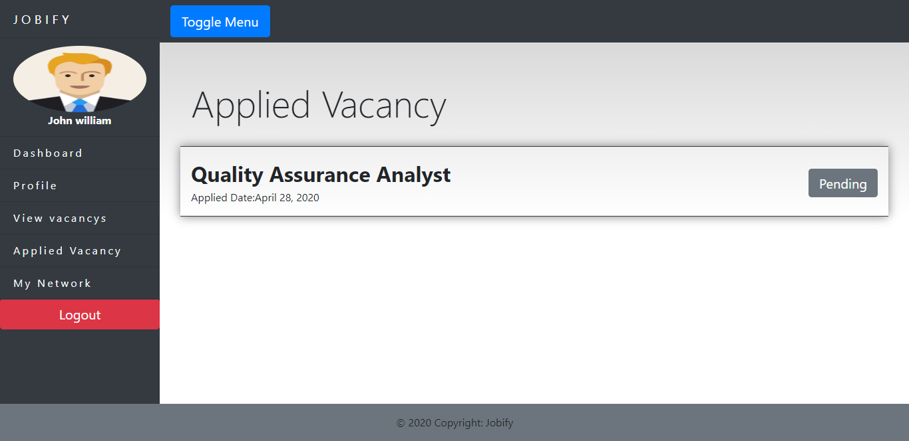</img>
<li>My Connections:
  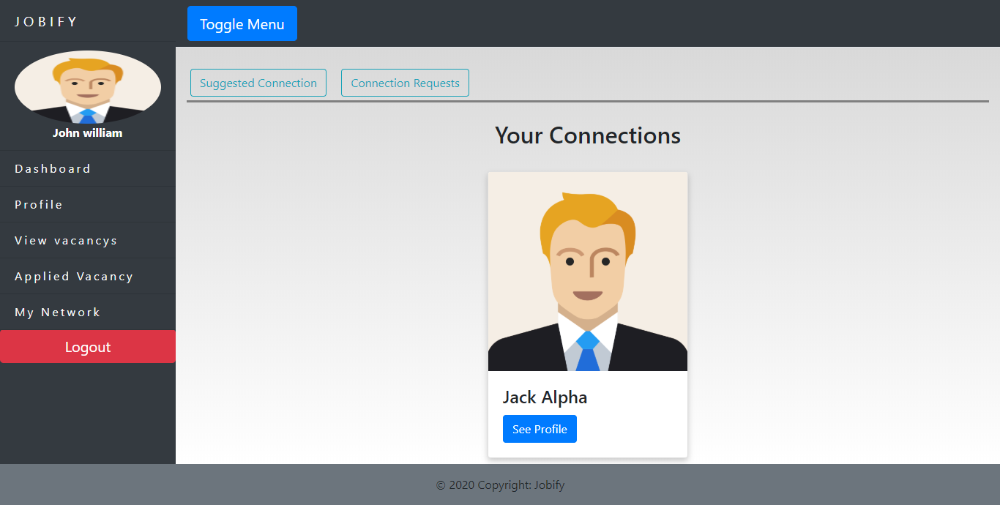</img>
<li>Suggested Connections:
  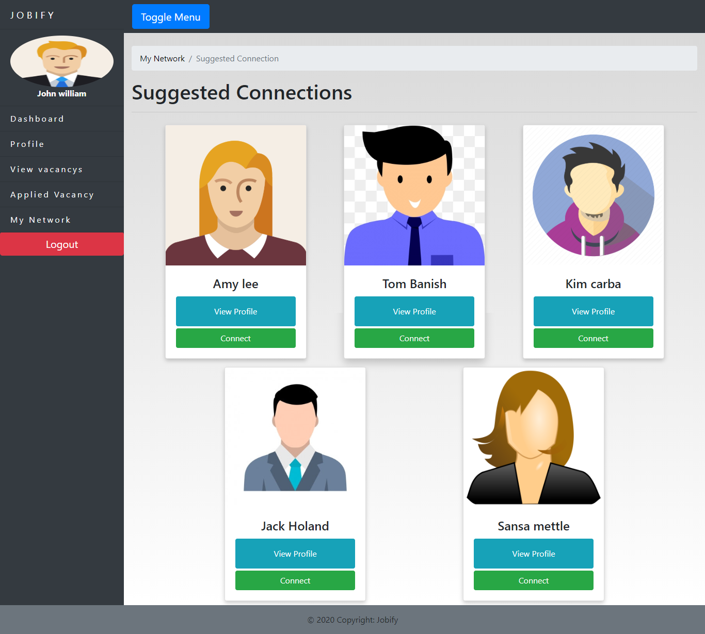</img>
<li>Connection Requests:
  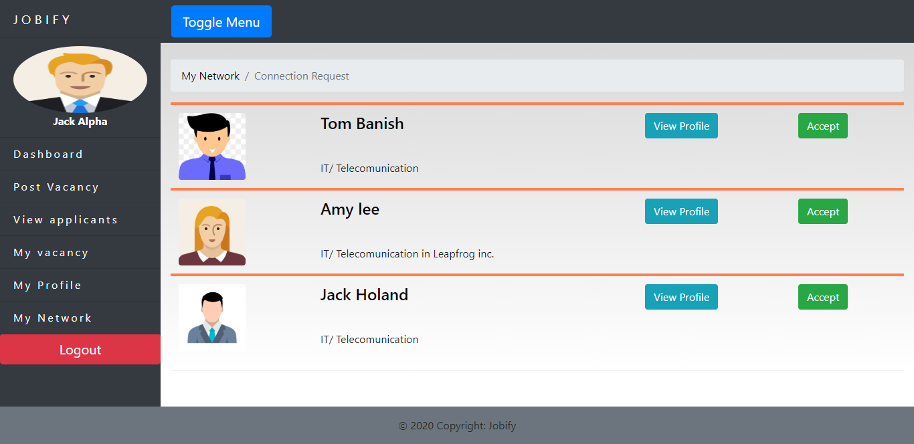</img>
<li>My Profile:
  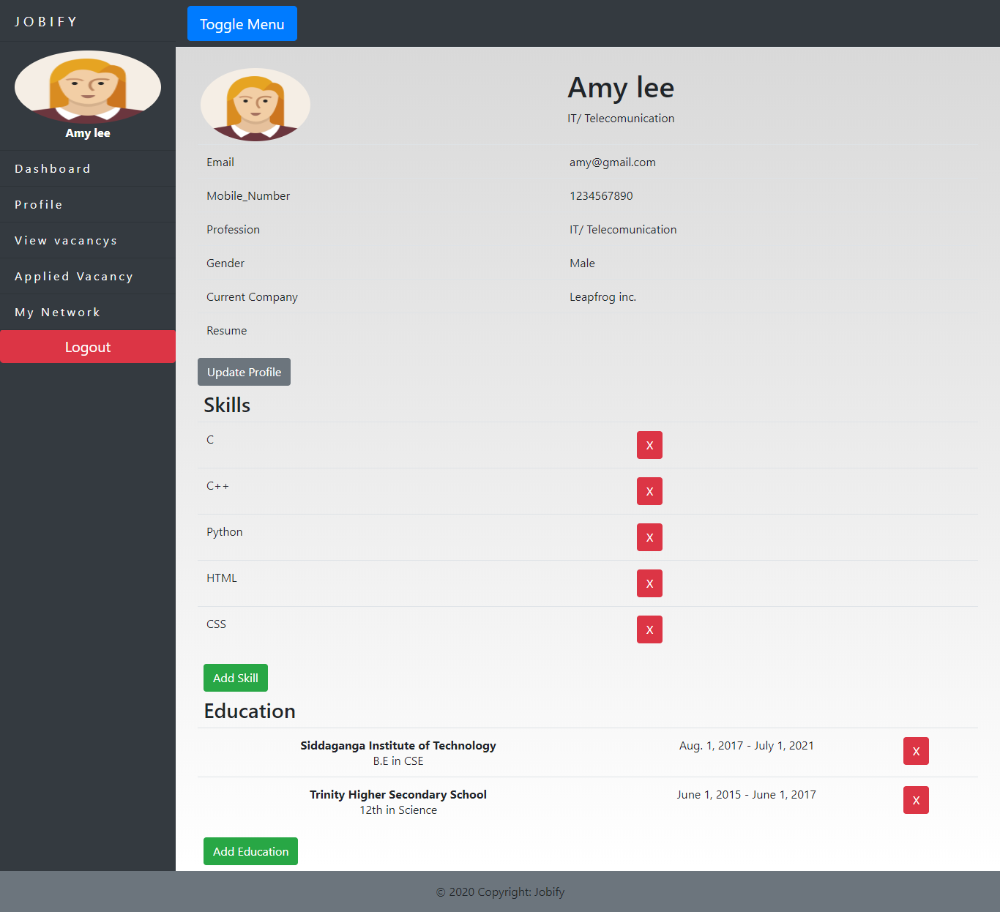</img></li>
</b>
